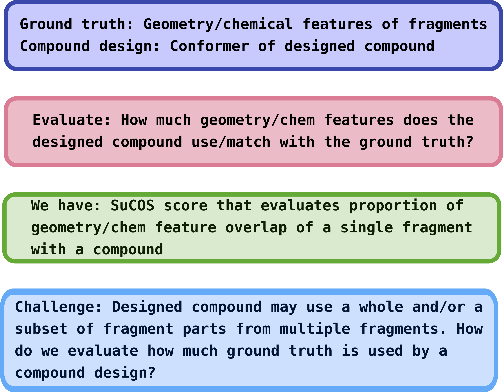
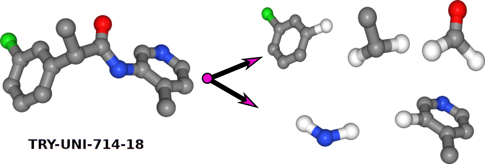
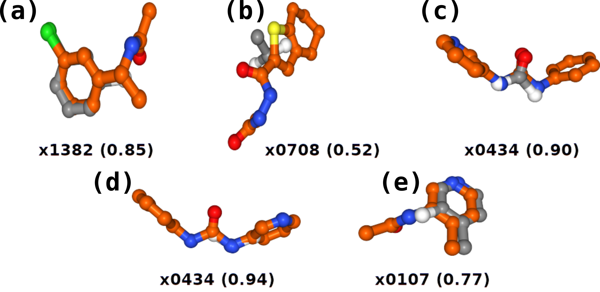
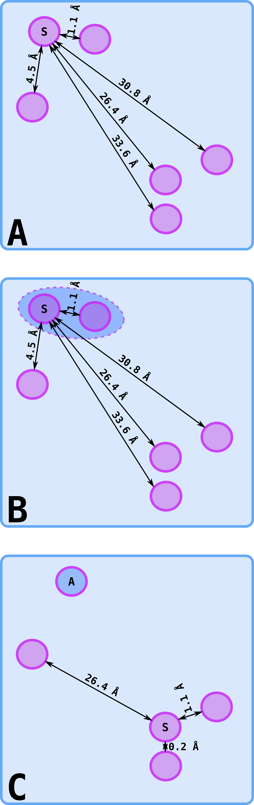

# xchem-xCOS

## Input datasets

Viewing on [Fragalysis](https://fragalysis.diamond.ac.uk/viewer/react/preview/target/Mpro):
1. WT-XCOS2-TEO-MOONSHOT - used [Matteos's permissive re-scored data](https://discuss.postera.ai/t/fragmenstein-assessing-fidelty-to-hits/1343/4) generated via [Fragmenstein method](https://github.com/matteoferla/Fragmenstein) as inputs for XCOS scoring

- You can view the best overlaying fragments (with an overlap score > 0.4) determined by XCOS by clicking the 'F' computed inspirations toggle in Fragalysis 

## Background
Using inspiration from the XChem [fragment screening experiment](https://www.diamond.ac.uk/covid-19/for-scientists/Main-protease-structure-and-XChem.html) at 
Diamond and a mass spectrometry screen of covalent fragments in the London Lab at the Weizmann Institute (Israel), the [COVID Moonshot project](https://discuss.postera.ai/c/covid)  
was born and the global scientific community invited to submit compound designs to inhibit the action of SARS-CoV-2 main protease (Mpro). 

What followed was an amazing response from a very diverse community of organic chemists, medicinal chemists and computational chemists. Thousands of compound 
designs have been submitted with different approaches. Using the geometry and chemical features, the ground truth, of the fragment screening experiment - 
a scoring method was needed to evaluate how much of this ground truth was retained in the compound designs (Fig. 1).

Figure 1: Overview of the knowns and unknowns for evaluating the geometry and chemical features of the screening fragments used in a compound design   

## XCOS for evaluating compound designs
XCOS is a simple scoring method that uses the [SuCOS](https://chemrxiv.org/articles/SuCOS_is_Better_than_RMSD_for_Evaluating_Fragment_Elaboration_and_Docking_Poses/8100203/1) scoring methodology. Designed compounds are broken into their component bits. Instead of measuring fragment overlay with a compound as is the case with SuCOS, 
XCOS quantifies the overlay of compounds bits with the screening fragments. This way, the geometry and feature space overlay are accounted for when parts of a fragment 
are used in a compound design. 
    
#### XCOS method summary
In brief, XCOS follows the following steps:
 1. Break designed compound into bits at rotable bonds

 
Figure 2: Step 1 of XCOS - designed compound on the left is broken into bits at rotable bonds   
  
 
 2. If the bit has an  maximum common substructure with the fragment then proceed to Step 3. Else, a score of 0 is given. 
 3. SuCOS score these individual bits to all of the screening fragments
  
 4. Capture best matching fragment with bit using highest score 
  

 
Figure 3: Step 2 and 3 - Each compound bit is scored for the best geometry and chemical feature overlay with the screening fragments. Fragment ID and the score is in brackets underneath each best bit/fragment match
  
5. Final score - the scores from each bit needed some additional treatment. See Scoring section below - using the SuCOS score for the overlay of bits with fragments, three scoring methods were used. 

#### Feature clustering summary
Clustering of features was used to add an additional penalty parameter to the scoring function used - see > Score_2

In brief, clustering of features was achieved by:

 1. Grouping features by feature name and their respective x,y,z coordinates of all the screening fragments
 3. Run nearest neighbors algorithm until all neighbors within a radius threshold are clustered together (Fig. 4)
 4. Get average value of xyz coords for each clustered feature (Fig. 4) 
 4. Calculate total features  

 
Figure 4: Overview of methodology used for clustering chemical features. (A) Find distances between edges of atoms (B) Cluster features that are within a distance threshold 
(C) Calculate average of x,y and z coordinates for clustered feature and repeat from (A)  

#### Scoring

The greater the value, the more 'ground truth' of the fragments are used in the compound 

where:
- N is the total number of bits
- n b is the number of heavy bit atoms
- S is the SuCOS overlay score of the bit with the best fragment
