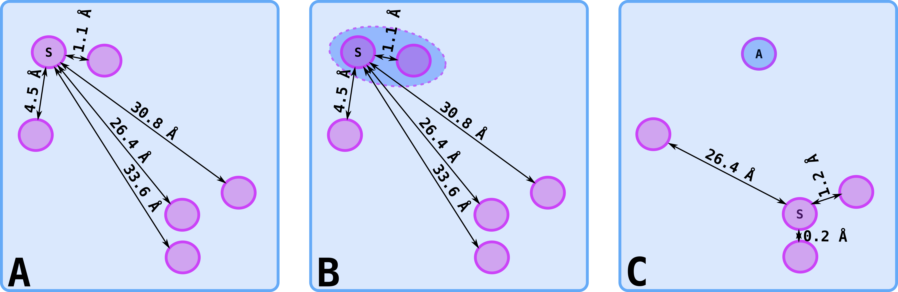

# xchem-xCOS

## Background
Using inspiration from the XChem [fragment screening experiment](https://www.diamond.ac.uk/covid-19/for-scientists/Main-protease-structure-and-XChem.html) at 
Diamond and a mass spectrometry screen of covalent fragments in the London Lab at the Weizmann Institute (Israel), the [COVID Moonshot project](https://discuss.postera.ai/c/covid)  
was born and the global scientific community invited to submit compound designs to inhibit the action of SARS-CoV-2 main protease (Mpro). 

What followed was an amazing response from a very diverse community of organic chemists, medicinal chemists and computational chemists. Thousands of compound 
designs have been submitted with different approaches. Using the geometery and chemical features, the ground truth, of the fragment screening experiment - 
a scoring method was needed to evaluate how much of this ground truth was retained in the compound designs (Fig. 1).

Figure 1: XX

## Aim

## XCOS for evaluating compound designs

#### XCOS method summary

 1. Break designed compound into bits at rotable bonds
 
 Figure 2: Designed compound on the left is broken into bits at rotable bonds 
   
 3. Use a [SuCOS score](https://chemrxiv.org/articles/SuCOS_is_Better_than_RMSD_for_Evaluating_Fragment_Elaboration_and_Docking_Poses/8100203/1) these individual bits to all of the fragments
 4. Capture best matching fragment with bit 

Figure 3: Using the SuCOS score, each bit is scored for best overlay with the screening fragments. Fragment ID and the SuCOS score is in brackets underneath each best bit/fragment match
5. Score - see Scoring section below - using the SuCOS score for the overlay of bits with fragments, three scoring methods were used. 

#### Feature clustering summary
Clustering of features was used to add an additional penalty paramter to the scoting function used - see > Score_2

In brief, clustering of features was achieved by:

 1. Grouping features by feature name and their respective x,y,z coordinates of all the screening fragments
 3. Run nearest neighbors algorithm until all neighbors within a radius threshold are clustered together 
 4. Get average value of xyz coords for each clustered feature 
 4. Calculate total features  
 

#### Scoring

## 